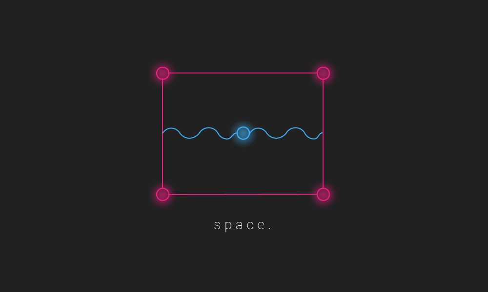

### Overview:

Space is a node-based reverb plugin.

------------------

### How to use:

1. Add Space to a track in your chosen DAW

2. Click and drag on the blue node to change mix and pan values.

3. Increase room size by click and dragging on a pink node.

------------------

### To install on MacOSX:

1. Navigate to the "Installers" folder.

2. Select the "MacOSX" folder 

3. Download and Run "Space.pkg" (You may have to enable the install if your security blocks it!)

4. Launch Space within chosen DAW :)

### To install on Windows:

1. Navigate to the "Installers" folder.

2. Select the "Windows" folder 

3. Download and Run "Space.exe" and follow the instructions within the installer

4. Launch Space within chosen DAW :)
